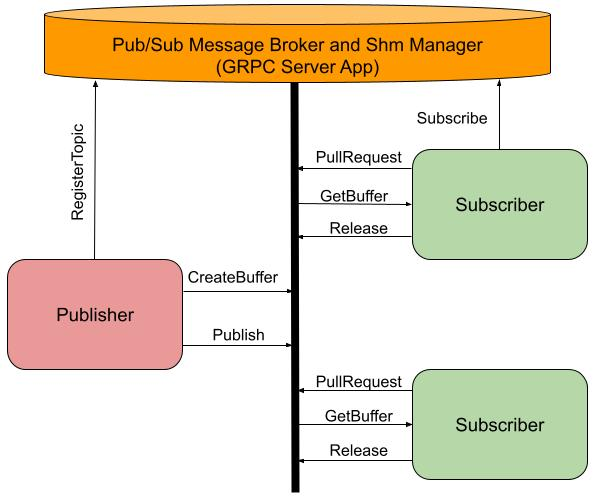
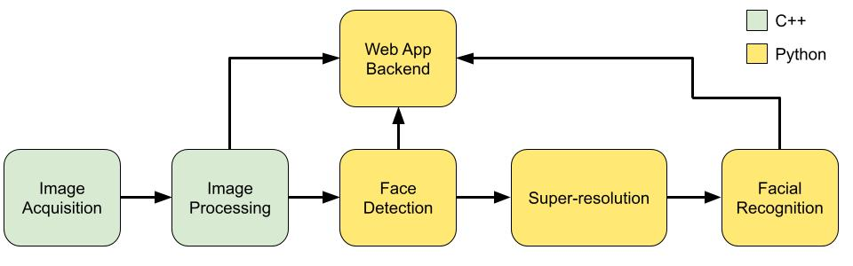

# tensor-bus
tensor-bus is a gRPC based server for managing interprocess communication via Unix shared memory. It was created to be the backbone of
embedded computer vision applications, where the imaging pipeline incorporates multiple languages and open-source models. However, the server
can be useful for any architecture where large data needs to be transferred between processes at regular intervals. tensor-bus implements a
publisher/subscriber pattern for isolated processes. The shm_server (denoted in orange in the figure below) functions as a message broker
between modules in a computer vision pipeline. The modules in your pipeline are all clients of the shm_server and can be a publisher,
subscriber, or both. [tensor-bus-example](https://github.com/shawn-rigdon/tensor-bus-example) uses tensor-bus to implement a streaming facial
recognition pipeline using a webcam for input data. The example is basic but demonstrates the advantages of using this approach.

<p align="center">
  
</p>

A common publisher is an image_acquisition program that will grab images from a camera using a C/C++ SDK and continually publish them. Such
a program will register a topic with the shm_server and enter it's main loop. Publisher loops follow a common structure of getting data,
requesting a shared memory buffer using an RPC call, writing the data into the shared memory buffer, and publishing the Linux filename of
the buffer to the topic. Conversely, Subscribers ingest the data by issuing a blocking call to Pull the next buffer filename, calling
GetBuffer to map the data, and Release the data when finished. This messaging scheme was used due to the speed of interprocess data
transfer (on the order of microseconds). As long as the developer uses pointers, no copies are necessary.

<p align="center">
  
</p>

This is an example pipeline to demonstrate the benefits of using this framework. Images are acquired from a camera, another service
processes them. The processed images are consumed by a face detector, which are enhanced by a super-resolution model, and finally, a
face recognition model is used to classify the enhanced faces. All of these processes will run in parallel, can be written in the most
suitable language, and can be containerized in an isolated environment, which is helpful when dealing with multiple Python projects. For
convenience, the Dockerfile for the shm_server is included. Multiple instances of each service (or module) can run in parallel to increase
frame rate. Therefore, the only limiting factor is the hardware. In this example pipeline, a web app can show the image stream with a
bounding box around the detected face and a label for the name. The shm_server will ensure the 3 messages (images, bounding boxes, and names)
are synchronized by allowing publishers to declare dependencies as shown in the
[tensor-bus-example](https://github.com/shawn-rigdon/tensor-bus-example). Only C++ and Python clients are supported at this time. You can
easily add support for other languages by implementing the RPC calls in the language of your choice using the existing clients as a guide.

## Requirements
* CMake >= 3.24
* Ninja >= 1.10
* g++ >= 8.0

## Building
External dependencies are incorporated via CMake for convenience. However, this causes build checks for gRPC to run every time you compile
with make, so using Ninja is recommended to speed up the development process. It's also advisable to use available cpu cores to speed up the
first compile since gRPC is a large project.
```
cmake -Bbuild -GNinja
cd build
ninja -j<num_cpus>
```
If you prefer to use make
```
cmake -Bbuild
cd build
make -j<num_cpus>
```

